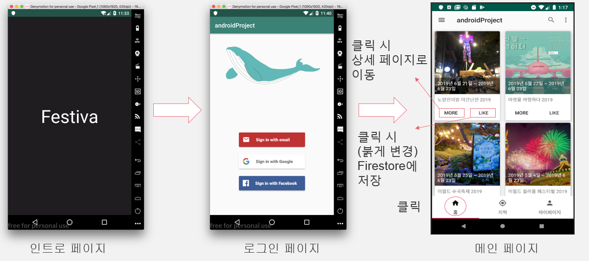
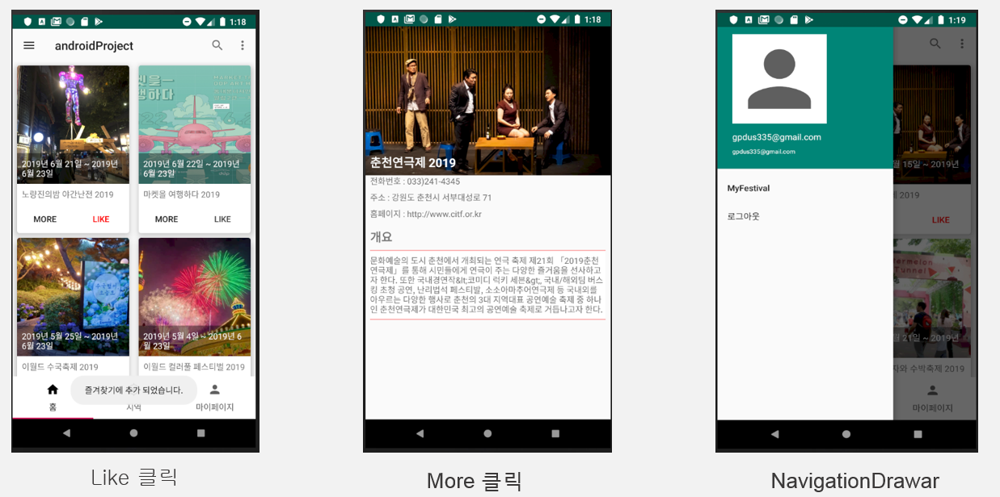
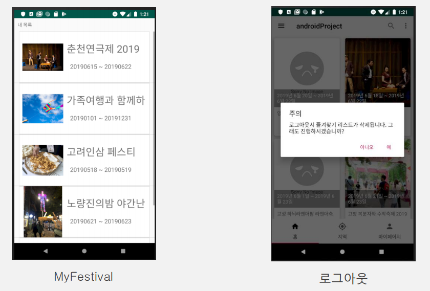
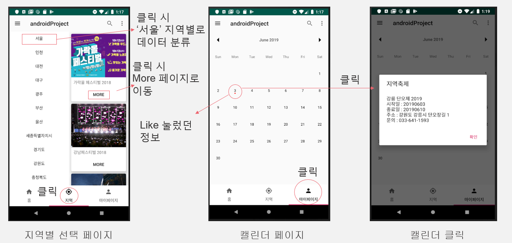

# 축제정보 제공 어플 (가제 : 이제는 웃는거야 스마일 어게인_엄정화의 Festival 中)

##어플 목적
◦ 벚꽃축제나 불꽃축제 빙어낚시 등 다양한 축제를 좋아하는데 축제에 관한 정보를 하나하나 찾아 봐야하는 것이 불편해서 기획하게 되었다. 

◦ 본 어플리케이션은 공공API를 통해 얻은 신뢰도 높은 지역별 축제정보를 제공하는 플렛폼으로 사용자가 원하는 정보를 지역 혹은 계절과 같은 카테고리 별로 알기 쉽게 제공한다. 

◦ 축제를 즐기고 싶은 사람들은 인터넷 검색이 아닌 앱을 실행시키는 것 만으로 축제정보를 얻을 수 있기 때문에 불편함을 해소하고, 더불어 지역 축제 활성화 또한 기여 할 것으로 예상된다.

##이론 및 기술현황
◦ 전국 축제 정보 API
-TourAPI를 이용하여 전국의 축제 정보 받아오기

◦ Firebase DB 연동
-Firebase를 이용한 사용자 DB 구현

◦ 지역별 위치 분류
-지역별로 축제 위치를 분류하여 사용자가 축제 정보를 찾기 쉽도록 구현

## 시행착오
1. API 수정
처음 사용하려던 API의 오류로 인한 수정
>> PredictHQ의 한국 지역 축제 정보 API를 발견해당 API로 수정 

2. 리뷰페이지 수정  
기능 구현의 문제로 어플의 처음 방향과는 다르게 페이지 수정
>> 리뷰 페이지를 위치 기반 분류 페이지로변경.
각 지역 별로 축제 정보 분류해서 보여주는 페이지로 수정

3. noSQL 기반 데이터 모델링
처음 사용해보는 데이터 모델링이라 효율적인 데이터 모델링의 어려움
>> 경험을 바탕으로 더 효율적인 데이터 모델링 기대

